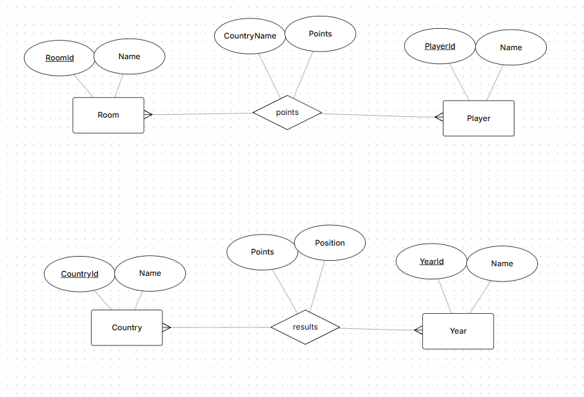
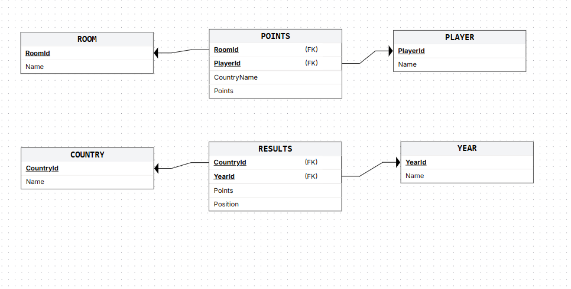

# EuroVote

**EuroVote** is a voting application designed to improve the viewing experience of the **Eurovision Song Contest** by turning it into a competitive activity among friends and family. Users can rate each performance in real time and compete to see who predicts the official results most accurately.

---

## Technology Stack

- **Frontend:** React  
- **Backend:** Python  
- **Database:** PostgreSQL  

---

## Documentation

## Use Case Diagram

## ER Diagram

## Relational Database Schema

- **Diagrams:** `/docs/diagrams`  
  - Use Case Diagram  
  - ER Diagram  
  - Relational Schema  
  - Class Diagram  
  - Sequence Diagram  

- **Figma Prototype:** `/docs/Figma Prototype`  
- **Product Vision:** `/docs/EuroVote's Product Vision.pdf`  

---
